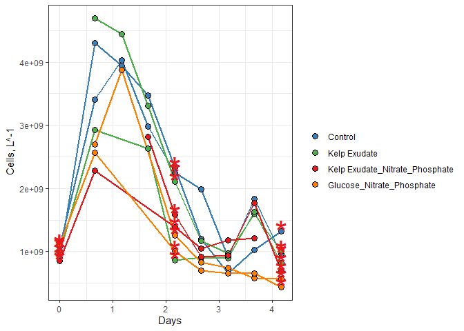
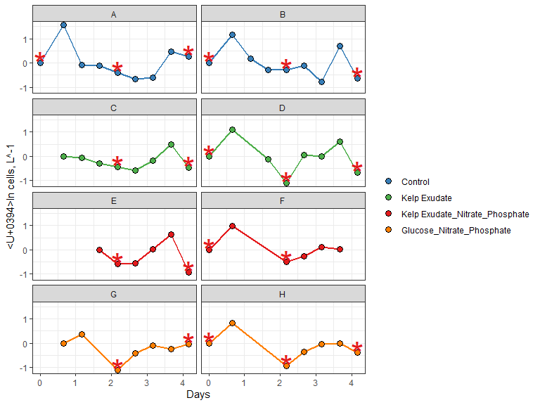
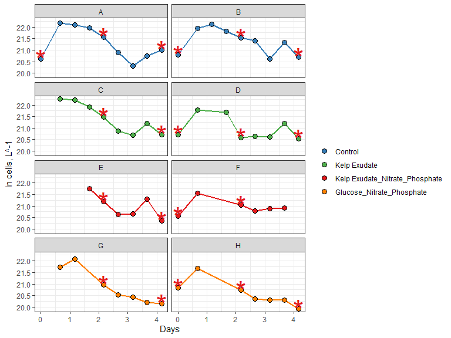

2021_abundance_data
================
Sam Daley
10/19/2021

# Goal

This document shows how **individual bottle** bacterial abundance data
from our 2021 remineralization experiments were processed, QC’d and
analyzed. It also provides an intro to data processing and analysis with
Rstudio and R Markdown.

#Intro to R Markdown

Create a new code chunk: Ctrl + alt + i

Run current chunk: Ctrl + alt + c

Load packages that we’ll need to analyze our data.

``` r
library(tidyverse)
```

    ## -- Attaching packages --------------------------------------- tidyverse 1.3.1 --

    ## v ggplot2 3.3.5     v purrr   0.3.4
    ## v tibble  3.1.4     v dplyr   1.0.7
    ## v tidyr   1.1.3     v stringr 1.4.0
    ## v readr   2.0.1     v forcats 0.5.1

    ## -- Conflicts ------------------------------------------ tidyverse_conflicts() --
    ## x dplyr::filter() masks stats::filter()
    ## x dplyr::lag()    masks stats::lag()

``` r
library(readxl)
library(lubridate)
```

    ## 
    ## Attaching package: 'lubridate'

    ## The following objects are masked from 'package:base':
    ## 
    ##     date, intersect, setdiff, union

We can toggle on/off warnings in chunks if we don’t want them in our
final markdown file.

# Import Data

``` r
excel_sheets("C:/Users/samro/Desktop/GitHub/144l_students_2021/Input_Data/week4/144L_2021_BactAbund.xlsx")
```

    ## [1] "Metadata" "Data"

``` r
metadata <- read_excel("C:/Users/samro/Desktop/GitHub/144l_students_2021/Input_Data/week4/144L_2021_BactAbund.xlsx", sheet = "Metadata")

glimpse(metadata)
```

    ## Rows: 80
    ## Columns: 16
    ## $ Experiment           <chr> "144L_2021", "144L_2021", "144L_2021", "144L_2021~
    ## $ Location             <chr> "Goleta Pier", "Goleta Pier", "Goleta Pier", "Gol~
    ## $ Temperature          <dbl> 19, 19, 19, 19, 19, 19, 19, 19, 19, 19, 19, 19, 1~
    ## $ Depth                <dbl> 1, 1, 1, 1, 1, 1, 1, 1, 1, 1, 1, 1, 1, 1, 1, 1, 1~
    ## $ Bottle               <chr> "A", "A", "A", "A", "A", "A", "A", "A", "A", "A",~
    ## $ Timepoint            <dbl> 0, 1, 2, 3, 4, 5, 6, 7, 8, 9, 0, 1, 2, 3, 4, 5, 6~
    ## $ Treatment            <chr> "Control", "Control", "Control", "Control", "Cont~
    ## $ Target_DOC_Amendment <dbl> 0, 0, 0, 0, 0, 0, 0, 0, 0, 0, 0, 0, 0, 0, 0, 0, 0~
    ## $ Inoculum_L           <dbl> 2, 2, 2, 2, 2, 2, 2, 2, 2, 2, 2, 2, 2, 2, 2, 2, 2~
    ## $ Media_L              <dbl> 5, 5, 5, 5, 5, 5, 5, 5, 5, 5, 5, 5, 5, 5, 5, 5, 5~
    ## $ Datetime             <chr> "2021-10-04T16:00", "2021-10-05T08:00", "2021-10-~
    ## $ TOC_Sample           <lgl> TRUE, FALSE, FALSE, FALSE, TRUE, FALSE, FALSE, FA~
    ## $ Cell_Sample          <lgl> TRUE, TRUE, TRUE, TRUE, TRUE, TRUE, TRUE, TRUE, T~
    ## $ DAPI_Sample          <lgl> TRUE, FALSE, FALSE, FALSE, TRUE, FALSE, FALSE, FA~
    ## $ DNA_Sample           <lgl> TRUE, FALSE, FALSE, FALSE, TRUE, FALSE, FALSE, FA~
    ## $ Nutrient_Sample      <lgl> TRUE, FALSE, FALSE, FALSE, FALSE, FALSE, FALSE, F~

``` r
#unique(metadata$Bottle)
#unique(metadata$Treatment)

data <- read_excel("C:/Users/samro/Desktop/GitHub/144l_students_2021/Input_Data/week4/144L_2021_BactAbund.xlsx", sheet = "Data")
glimpse(data)
```

    ## Rows: 72
    ## Columns: 5
    ## $ Bottle       <chr> "A", "A", "A", "A", "A", "A", "A", "A", "A", "B", "B", "B~
    ## $ Timepoint    <dbl> 0, 1, 2, 3, 4, 5, 6, 7, 8, 0, 1, 2, 3, 4, 5, 6, 7, 8, 0, ~
    ## $ all_cells_uL <chr> "901.48904752420799", "4302.9300548457404", "3944.9457004~
    ## $ LNA_cells_uL <chr> "653.047184033284", "768.27893058466896", "937.2441189022~
    ## $ HNA_cells_uL <chr> "248.441863490923", "3534.65112426107", "3007.70158156820~

``` r
joined <- left_join(metadata, data) #attach data to metadata
```

    ## Joining, by = c("Bottle", "Timepoint")

``` r
#joins right dataset to the left one by using variables that are the same across the two dataframes
```

# Prepare Data

We will convert the Date and Time column values from characters to
dates, add columns with time elapsed for each treatment, and convert to
cells/L because it will help us match up with the TOC data later. We
will then subset the data for variables of interest and drop NA values.

To do this, we are going to be using **piping**. Piping is an operation
that allows us to write more efficient code. The way that we’ll use it
here is to manipulate our data sequesntially. The pipe operator, %>%,
which basically says like “first do one thing to the data. THEN, do this
other thing.” (with the %>% operator taking the place of the word THEN
in this scenario). Every call that we invoke with an additional pipe is
going to take place on the variable (dataframe) that we specify at the
beginning.

``` r
cells <- joined %>%
  mutate(Datetime = ymd_hm(Datetime), #splits apart Datetime as specified
  all_cells_L = as.numeric(all_cells_uL)*1000000,
  LNA_cells_L = as.numeric(LNA_cells_uL)*1000000,
  HNA_cells_L = as.numeric(HNA_cells_uL)*1000000)  %>%
  group_by(Treatment, Bottle) %>%
#group our data set so that we can calculate the time elapsed properly
  mutate(interv = interval(first(Datetime), Datetime),
         s = as.numeric(interv),
         hours = s/3600,
         days = hours/24) %>%
  ungroup() %>%
  select(Experiment:DNA_Sample, all_cells_L, LNA_cells_L, HNA_cells_L, hours, days) %>%
  drop_na(all_cells_L)
glimpse(cells)
```

    ## Rows: 60
    ## Columns: 20
    ## $ Experiment           <chr> "144L_2021", "144L_2021", "144L_2021", "144L_2021~
    ## $ Location             <chr> "Goleta Pier", "Goleta Pier", "Goleta Pier", "Gol~
    ## $ Temperature          <dbl> 19, 19, 19, 19, 19, 19, 19, 19, 19, 19, 19, 19, 1~
    ## $ Depth                <dbl> 1, 1, 1, 1, 1, 1, 1, 1, 1, 1, 1, 1, 1, 1, 1, 1, 1~
    ## $ Bottle               <chr> "A", "A", "A", "A", "A", "A", "A", "A", "A", "B",~
    ## $ Timepoint            <dbl> 0, 1, 2, 3, 4, 5, 6, 7, 8, 0, 1, 2, 3, 4, 5, 6, 7~
    ## $ Treatment            <chr> "Control", "Control", "Control", "Control", "Cont~
    ## $ Target_DOC_Amendment <dbl> 0, 0, 0, 0, 0, 0, 0, 0, 0, 0, 0, 0, 0, 0, 0, 0, 0~
    ## $ Inoculum_L           <dbl> 2, 2, 2, 2, 2, 2, 2, 2, 2, 2, 2, 2, 2, 2, 2, 2, 2~
    ## $ Media_L              <dbl> 5, 5, 5, 5, 5, 5, 5, 5, 5, 5, 5, 5, 5, 5, 5, 5, 5~
    ## $ Datetime             <dttm> 2021-10-04 16:00:00, 2021-10-05 08:00:00, 2021-1~
    ## $ TOC_Sample           <lgl> TRUE, FALSE, FALSE, FALSE, TRUE, FALSE, FALSE, FA~
    ## $ Cell_Sample          <lgl> TRUE, TRUE, TRUE, TRUE, TRUE, TRUE, TRUE, TRUE, T~
    ## $ DAPI_Sample          <lgl> TRUE, FALSE, FALSE, FALSE, TRUE, FALSE, FALSE, FA~
    ## $ DNA_Sample           <lgl> TRUE, FALSE, FALSE, FALSE, TRUE, FALSE, FALSE, FA~
    ## $ all_cells_L          <dbl> 901489048, 4302930055, 3944945700, 3467546844, 23~
    ## $ LNA_cells_L          <dbl> 653047184, 768278931, 937244119, 819317989, 65732~
    ## $ HNA_cells_L          <dbl> 248441863, 3534651124, 3007701582, 2648228855, 16~
    ## $ hours                <dbl> 0, 16, 28, 40, 52, 64, 76, 88, 100, 0, 16, 28, 40~
    ## $ days                 <dbl> 0.0000000, 0.6666667, 1.1666667, 1.6666667, 2.166~

# Plot Growth Curves

We will plot growth curves for each bottle. Need cell abundance and days
data.

First, let’s see some aesthetics for our plot.

``` r
#assign hex colors to our different treatments
custom.colors <- c("Control" = "#377EB8", "Kelp Exudate" = "#4DAF4A", "Kelp Exudate_Nitrate_Phosphate" = "#E41A1C", "Glucose_Nitrate_Phosphate" = "#FF7F00")

#assign levels to control what order things appear in the legend
levels <- c("Control", "Kelp Exudate", "Kelp Exudate_Nitrate_Phosphate", "Glucose_Nitrate_Phosphate")

#now let's use a handy package, ggplot, to visualize our data.

cells %>%
  mutate(dna = ifelse(DNA_Sample == T, "*", NA)) %>%
  ggplot(aes(x=days, y=all_cells_L, group = interaction(Treatment, Bottle))) +
  geom_line(aes(color = factor(Treatment, levels = levels)), size = 1) +
  geom_point(aes(fill = factor(Treatment, levels = levels)), size = 3, color = "black", shape = 21) +
  geom_text(aes(label = dna), size = 12, color = "#E41A1C") +
  labs(x = "Days", y = expression(paste("Cells, L^-1")), fill = "") +
  guides(color = "none") +
  scale_color_manual(values = custom.colors) +
  scale_fill_manual(values = custom.colors) +
  #facet_grid(rows = "Treatment")
  theme_bw()
```

    ## Warning: Removed 40 rows containing missing values (geom_text).

<!-- -->

``` r
glimpse(cells)
```

    ## Rows: 60
    ## Columns: 20
    ## $ Experiment           <chr> "144L_2021", "144L_2021", "144L_2021", "144L_2021~
    ## $ Location             <chr> "Goleta Pier", "Goleta Pier", "Goleta Pier", "Gol~
    ## $ Temperature          <dbl> 19, 19, 19, 19, 19, 19, 19, 19, 19, 19, 19, 19, 1~
    ## $ Depth                <dbl> 1, 1, 1, 1, 1, 1, 1, 1, 1, 1, 1, 1, 1, 1, 1, 1, 1~
    ## $ Bottle               <chr> "A", "A", "A", "A", "A", "A", "A", "A", "A", "B",~
    ## $ Timepoint            <dbl> 0, 1, 2, 3, 4, 5, 6, 7, 8, 0, 1, 2, 3, 4, 5, 6, 7~
    ## $ Treatment            <chr> "Control", "Control", "Control", "Control", "Cont~
    ## $ Target_DOC_Amendment <dbl> 0, 0, 0, 0, 0, 0, 0, 0, 0, 0, 0, 0, 0, 0, 0, 0, 0~
    ## $ Inoculum_L           <dbl> 2, 2, 2, 2, 2, 2, 2, 2, 2, 2, 2, 2, 2, 2, 2, 2, 2~
    ## $ Media_L              <dbl> 5, 5, 5, 5, 5, 5, 5, 5, 5, 5, 5, 5, 5, 5, 5, 5, 5~
    ## $ Datetime             <dttm> 2021-10-04 16:00:00, 2021-10-05 08:00:00, 2021-1~
    ## $ TOC_Sample           <lgl> TRUE, FALSE, FALSE, FALSE, TRUE, FALSE, FALSE, FA~
    ## $ Cell_Sample          <lgl> TRUE, TRUE, TRUE, TRUE, TRUE, TRUE, TRUE, TRUE, T~
    ## $ DAPI_Sample          <lgl> TRUE, FALSE, FALSE, FALSE, TRUE, FALSE, FALSE, FA~
    ## $ DNA_Sample           <lgl> TRUE, FALSE, FALSE, FALSE, TRUE, FALSE, FALSE, FA~
    ## $ all_cells_L          <dbl> 901489048, 4302930055, 3944945700, 3467546844, 23~
    ## $ LNA_cells_L          <dbl> 653047184, 768278931, 937244119, 819317989, 65732~
    ## $ HNA_cells_L          <dbl> 248441863, 3534651124, 3007701582, 2648228855, 16~
    ## $ hours                <dbl> 0, 16, 28, 40, 52, 64, 76, 88, 100, 0, 16, 28, 40~
    ## $ days                 <dbl> 0.0000000, 0.6666667, 1.1666667, 1.6666667, 2.166~

# Next Steps

We can calculate:

-total change in cells from initial condition to the end of the
experiment. -specific growth rate as the slope of ln(abundance) v time
during exonential growth phase. -doubling time as ln(2) divided by the
specific growth rate. -mean of each of these parameters across each
treatment.

1st we need to determine **where** exponential growth is ocurring in
each of our bottles, if it does. To do this, we’ll plot ln(abundance) vs
time.

#Identify exponentia; phase of growth in our experiments

**Note about logarithms in R**

log(x) gives the natural log of x, not log base 10 log10(x) gives the
log base 10 log2(x) gives log base 2

``` r
ln_cells <- cells %>%
  group_by(Treatment, Bottle) %>%
  mutate(ln_cells = log(all_cells_L),
         diff_ln_cells = ln_cells - lag(ln_cells, default = first(ln_cells)))
```

Now, let’s plot our newly calculated data!

``` r
ln_cells %>%
  mutate(dna = ifelse(DNA_Sample == T, "*", NA)) %>%
  ggplot(aes(x=days, y=diff_ln_cells, group = interaction(Treatment, Bottle))) +
  geom_line(aes(color = factor(Treatment, levels = levels)), size = 1) +
  geom_point(aes(fill = factor(Treatment, levels = levels)), size = 3, color = "black", shape = 21) +
  geom_text(aes(label = dna), size = 12, color = "#E41A1C") +
  labs(x = "Days", y = expression(paste("Δln cells, L^-1")), fill = "") +
  guides(color = "none") +
  scale_color_manual(values = custom.colors) +
  scale_fill_manual(values = custom.colors) +
  facet_wrap("Bottle", ncol = 2) +
  theme_bw()
```

    ## Warning: Removed 40 rows containing missing values (geom_text).

<!-- -->
Exponential growth seems to be occurring at the beginning of the
experiment between 0 and 0.75 days for most bottles, though bottles C,
E, and G lack the data necessarry to see this.

Le’s try plotting ln_cells to see if that can help us identify
exponential growth in the control a little better.

``` r
ln_cells %>%
  mutate(dna = ifelse(DNA_Sample == T, "*", NA)) %>%
  ggplot(aes(x=days, y=ln_cells, group = interaction(Treatment, Bottle))) +
  geom_line(aes(color = factor(Treatment, levels = levels)), size = 1) +
  geom_point(aes(fill = factor(Treatment, levels = levels)), size = 3, color = "black", shape = 21) +
  geom_text(aes(label = dna), size = 12, color = "#E41A1C") +
  labs(x = "Days", y = expression(paste("ln cells, L^-1")), fill = "") +
  guides(color = "none") +
  scale_color_manual(values = custom.colors) +
  scale_fill_manual(values = custom.colors) +
  facet_wrap("Bottle", ncol = 2) +
  theme_bw()
```

    ## Warning: Removed 40 rows containing missing values (geom_text).

<!-- -->
